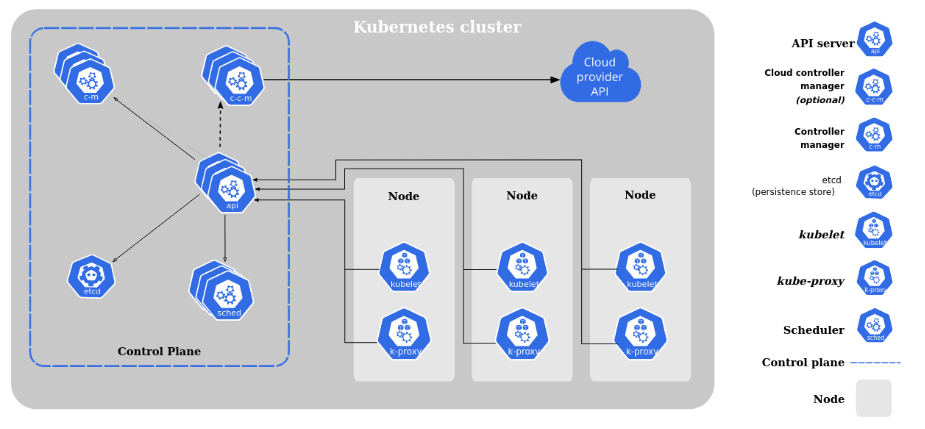
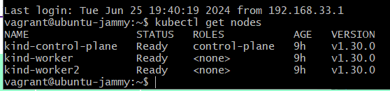
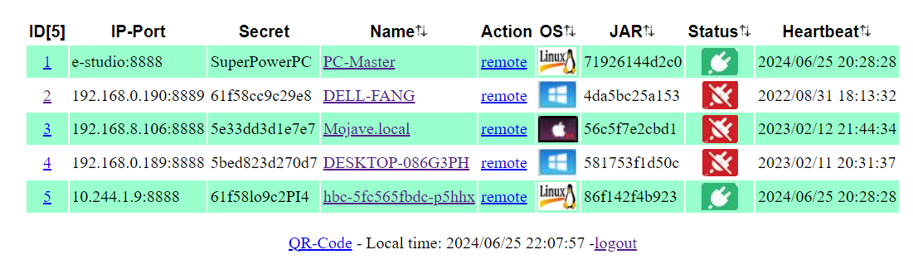
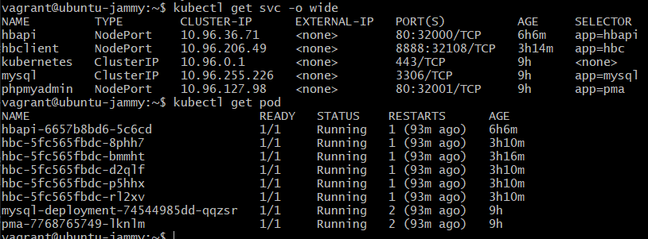

## Hands-on Kubernetes

Here is Hands-on setup via using minikube cluster local setup(Kind)
- role: control-plane
- role:  worker
- role:  worker

## Screenshots - setup local cluster

- https://kubernetes.io/docs/tasks/tools/install-kubectl-linux/
- https://kind.sigs.k8s.io/docs/user/quick-start/

## Components

prepare MySQL with PersistentVolume and initial Database
- k8s/mysql.yaml

setup phpmyadmin deployment and service
- k8s/pma.yaml 

setup heartbeat control system
- k8s/hbapi.yaml

setup runner with 3 replicas   
- k8s/hbclient.yaml

## Extra setup steps on Host via ansible

portainer:
- ansible/portainer.yml

local HBclient
- ansible/installHB.yml

## Screenshots - Results

web list

Pods and services

## Hands-on load testing

- with Grafana-K6

- with Apache-Jmeter

