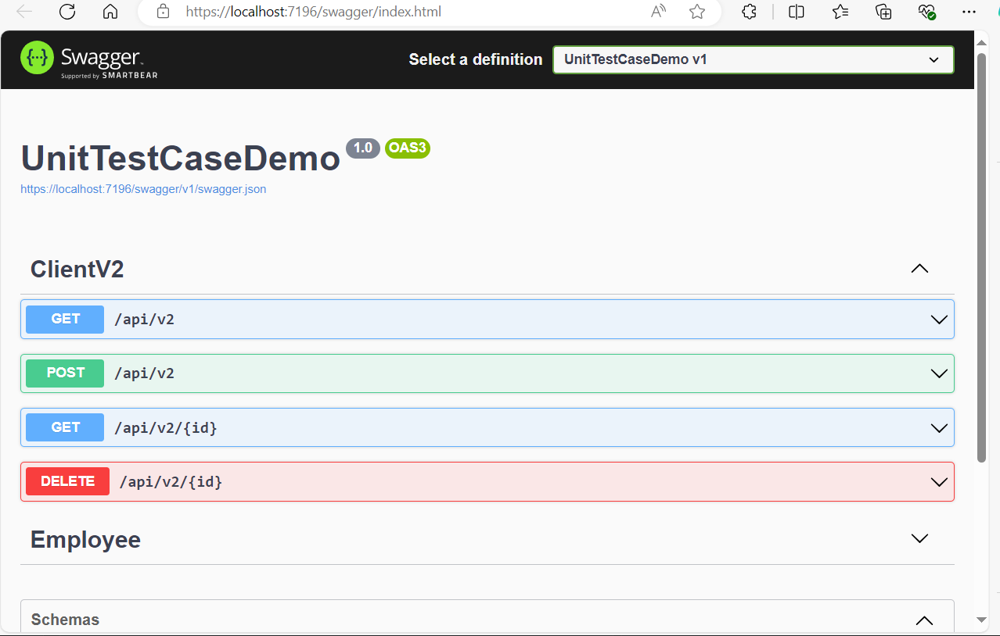

## Internal api server for testing

- ASP.net MVC swagger API server for CRUD operation

## Hands-on load testing

- with Grafana-K6 (http-load, webAPI, browser action)

- with Apache-Jmeter ( TCP sample, web API, https records)

