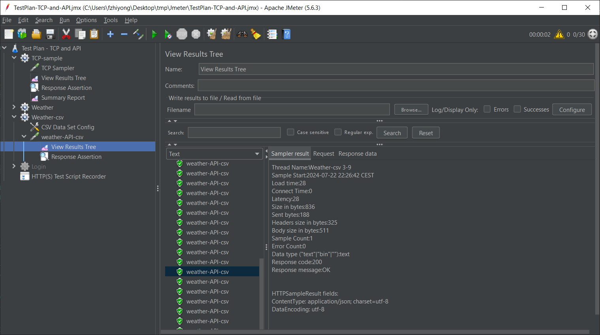

# Hands-on! Build your Performance Test Suite with Apache Jmeter

An example project used to demonstrate build performance test capabilities of using jmeter for TCP socket connection, API

## Pre-requisites

- java 8 and 11
- Jmeter 5.6.3 or above

## Start with your Test Plan

- TCP-sample
- API with user define variable
- API with CSV Data
- Https Test script recorder

## Setup

