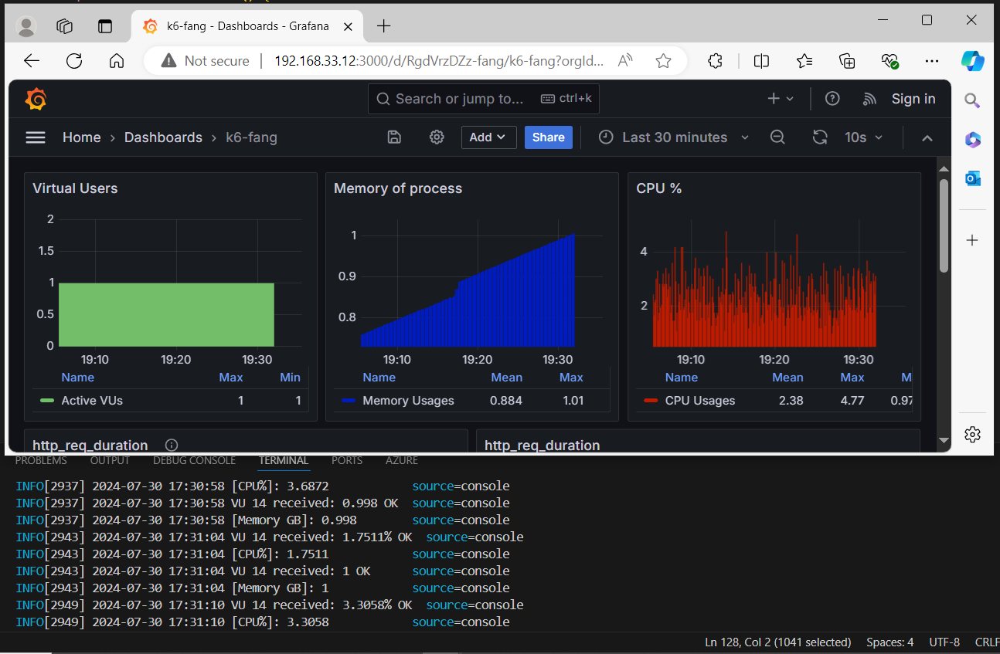

# k6 api and browser demo

An example project used to demonstrate the browser capabilities of k6.

## Pre-requisites

- k6 version 0.50 and above
- default headless
- K6_BROWSER_HEADLESS=false -> lauch browser

## Running the test under linux/mac

```bash
cd tests
K6_BROWSER_ENABLED=true k6 run <script-to-run>
```
## Running the test under windows command
```bash
cd tests
set "K6_BROWSER_HEADLESS=false" && k6 run tests\multiple-scenario.js
```
## Advanced: K6 with Grafana


## K6 with netdata/cloud

- k6 run --out statsd hello.js
- k6 cloud hello.js

## K6 with influxdb

- docker-compose up -d influxdb grafana
- k6 run .\cpu-memory.js --out influxdb=http://192.168.33.12:8086/k6
- using websoket to pull out the cpu and memory infomation
- apply load action
- details refer 

## Refer to Orignial Video

- refer to setup video
- import dashboard with extra panels for memory and cpu [data/grafana_dashboard.json]
[](https://www.youtube.com/watch?v=Hu1K2ZGJ_K4)
